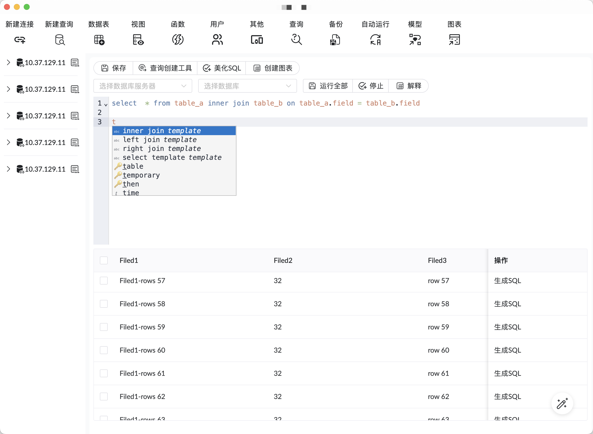

# [tauri-ide-next](https://github.com/yndgroups/tauri-ide-next)

> 新一代的ide工具

## 添加插件

```
pnpm add palm-editor --filter app
pnpm add palm-util --filter app
pnpm add @tauri-apps/plugin-sqlite --filter app
```

## 项目图片


