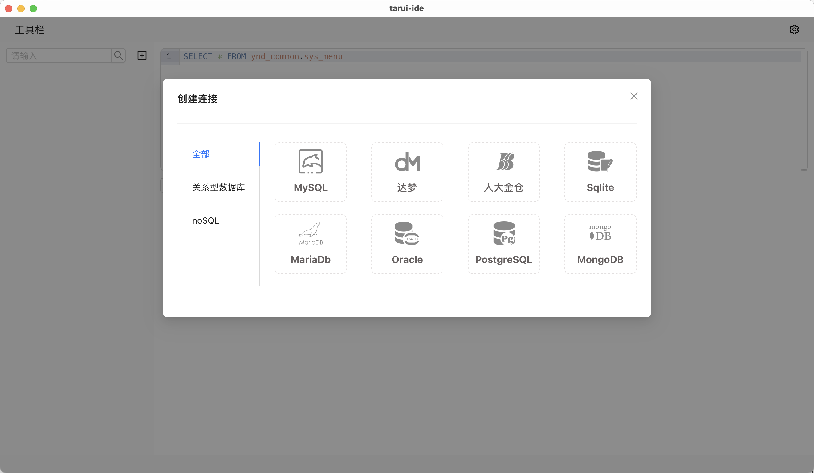
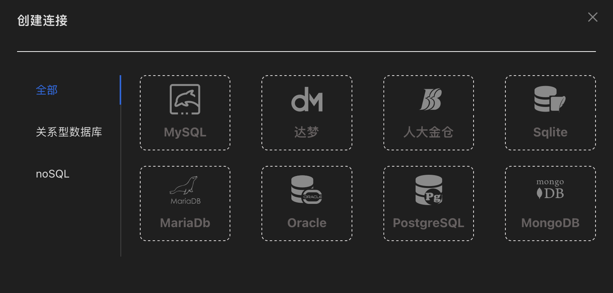
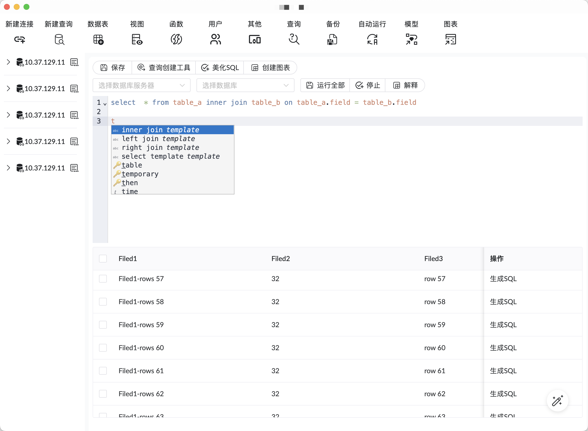
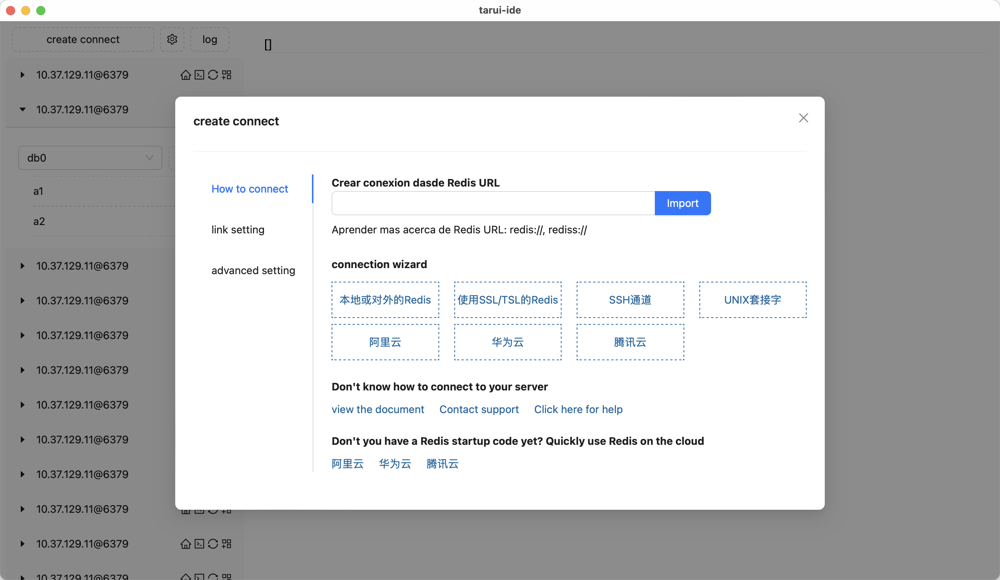

# [tauri-ide-next](https://github.com/yndgroups/tauri-ide-next)

> 新一代的ide工具

## 运行命令
- redis
```
pnpm dev:redis
```

- 数据库管理
```
pnpm dev:db
```
- 更多请查看 package.json 里的相关命令

## 添加插件

```
pnpm add palm-editor --filter app
pnpm add palm-util --filter app
pnpm add @tauri-apps/plugin-sqlite --filter app
```

## 项目图片

### 添加连接



## 主题切换



### SQL编写



### 国际化

